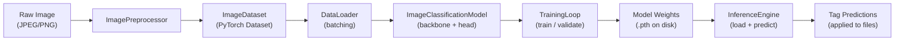

# Revised Correction Plan — Full Reference Document

> **Purpose:** This document consolidates all revision items (Issues 2–5), provides ready-to-insert text, populated table templates, and a complete technical description of the ML module pipeline from preprocessing through inference.

---

## 1. ML Module Architecture — End-to-End Pipeline

The machine learning subsystem is implemented as a modular Python package (`ml/`) composed of six files, each responsible for a distinct stage of the pipeline. The diagram below illustrates the full data flow from raw image to applied tag predictions.



### 1.1 Preprocessing Stage — `ml/preprocessor.py`

The `ImagePreprocessor` class defines **two separate transform pipelines**, both built on `torchvision.transforms`:

| Pipeline | Used During | Transforms Applied |
|----------|------------|-------------------|
| `transform` (deterministic) | Inference & Validation | Resize(256) → CenterCrop(224×224) → ToTensor → Normalize(ImageNet μ/σ) |
| `train_transform` (stochastic) | Training only | RandomResizedCrop(224, scale 0.7–1.0) → RandomHorizontalFlip → ColorJitter(brightness=0.2, contrast=0.2, saturation=0.2, hue=0.05) → ToTensor → Normalize(ImageNet μ/σ) |

**Normalization constants** use the standard ImageNet channel means `(0.485, 0.456, 0.406)` and standard deviations `(0.229, 0.224, 0.225)`, which ensures compatibility with pretrained backbone weights.

The stochastic training augmentations serve as implicit regularization — each epoch sees slightly different crops, flips, and colour variations of the same image, reducing overfitting on small datasets.

Key methods:
- `preprocess_image(path)` — loads a single image as PIL RGB, applies the deterministic pipeline, returns a `torch.Tensor` (or `None` on failure).
- `preprocess_batch(paths)` — processes multiple images, returns `(stacked_tensor, valid_indices)` so callers can align predictions even when some images fail to load.

### 1.2 Dataset Wrapper — `ml/dataset.py`

`ImageDataset` extends `torch.utils.data.Dataset` and supports two label formats:

| Mode | Label Type | Loss Function Used |
|------|-----------|-------------------|
| **Single-label** | `List[int]` (class index) | `CrossEntropyLoss` |
| **Multi-label** | `List[List[float]]` (binary vector) | `BCEWithLogitsLoss` |

On `__getitem__`, the dataset opens the image via PIL, applies the supplied transform, and returns `(image_tensor, label)`. Corrupt or missing files produce a black placeholder image `(0,0,0)` to prevent DataLoader hangs.

### 1.3 Model Architecture — `ml/model.py`

`ImageClassificationModel(nn.Module)` implements a **backbone + classification head** design:

1. **Backbone** — a pretrained CNN loaded from `torchvision.models`. The original classification layer is replaced with `nn.Identity()` so the raw feature vector passes through.
2. **Classification Head** — a configurable stack of `Linear → ReLU → Dropout` layers ending with a final `Linear(in_features, num_classes)` producing raw logits.

Supported backbone architectures:

| Model Type | Parameter Count | ImageNet Top-1 | Feature Dim |
|-----------|----------------|----------------|-------------|
| `resnet18` | 11.7 M | 69.8% | 512 |
| `resnet34` | 21.8 M | 73.3% | 512 |
| `resnet50` | 25.6 M | 76.1% | 2048 |
| `efficientnet_b0` | 5.3 M | 77.1% | 1280 |
| `efficientnet_b1` | 7.8 M | 78.8% | 1280 |
| `mobilenet_v2` | 3.4 M | 71.9% | 1280 |
| `vgg16` | 138.4 M | 71.6% | 4096 |

The default hidden layers are `[256, 128, 64]` with dropout rate 0.3, configured via `config.py`.

### 1.4 Training Pipeline — `ml/training.py`

The `TrainingLoop` class orchestrates the complete training process:

#### A. Data Preparation

Two data sources are supported:

| Source | Method | Label Type | Use Case |
|--------|--------|-----------|----------|
| **Folder structure** | `prepare_data_from_folders(root)` | Multi-label (folder hierarchy → binary vector) | Personal photo collections |
| **Database tags** | `prepare_data_from_database()` | Multi-label (DB tags → binary vector) | After manual tagging |
| **COCO benchmark** | External `COCOBenchmarkLoader` | Multi-label (80 COCO categories) | Reproducible evaluation |

For folder-based preparation, each image's parent directory chain becomes its tag set. For example, an image at `Photos/Travel/Beach/sunset.jpg` receives tags `["Travel", "Beach"]`. All unique tags are sorted alphabetically and encoded as binary vectors of length `N_tags`.

#### B. Stratified Data Splitting

The `_three_way_split()` method partitions data into **train (70%) / validation (15%) / test (15%)**:

```
Full Dataset
    │
    ├── _stratified_split(test_split=0.15) ──→ Test Set (15%, held out)
    │
    └── Remaining (85%)
         │
         └── _stratified_split(val_split=0.176) ──→ Val Set (15% of total)
                                                     Train Set (70% of total)
```

For **multi-label** data, an iterative greedy algorithm ensures balanced representation:
1. Compute per-class target counts for the validation set: `desired_val = tag_counts × val_fraction`.
2. Shuffle indices with a fixed seed (`rng = np.random.default_rng(42)`).
3. For each image, check if any of its active tags are still underrepresented in the val set. If so, assign to val; otherwise, assign to train.

This guarantees that even rare tags with only a handful of images appear in all three partitions.

#### C. Loss Function Configuration

| Mode | Loss | Class Balancing |
|------|------|----------------|
| Multi-label | `BCEWithLogitsLoss` | `pos_weight = (N − c_k) / c_k` per class — upscales rare tags |
| Single-label | `CrossEntropyLoss` | `weight = N / (K × c_k)` per class |

The positive-weight balancing is critical for the 59-tag personal dataset, where the imbalance ratio can exceed 50×. Without it, the model converges to predicting only majority classes.

#### D. Epoch Loop

Each epoch proceeds as:

1. **Forward pass** — images through backbone + head → raw logits.
2. **Loss computation** — BCEWithLogitsLoss (multi-label) or CrossEntropyLoss (single-label).
3. **Backward pass** — gradient computation with optional AMP (`torch.amp.autocast` + `GradScaler` on CUDA).
4. **Optimizer step** — Adam with configurable learning rate (default 0.001).
5. **Validation** — full pass over validation set computing accuracy, macro F1, and micro F1.
6. **Early stopping** — if validation accuracy does not improve for `patience` consecutive epochs (default: 3), training halts.

Per-epoch metrics logged:
```
Epoch 3/8  Loss: 1.2847  Train: 71.23%  Val: 73.89%  MacroF1: 0.4521  MicroF1: 0.6234  ETA: 12m 30s
```

#### E. Validation with F1 Scores

The `validate()` method returns `(accuracy%, macro_f1, micro_f1)`:

```python
from sklearn.metrics import f1_score
macro_f1 = f1_score(y_true, y_pred, average='macro', zero_division=0)
micro_f1 = f1_score(y_true, y_pred, average='micro', zero_division=0)
```

- **Macro F1** — unweighted mean of per-class F1. Sensitive to performance on rare tags. Expected to be significantly lower than accuracy when class imbalance is severe.
- **Micro F1** — computed globally by counting total TP/FP/FN. Dominated by frequent classes, thus closer to accuracy.

#### F. Model Persistence

After training completes (and before releasing the model from GPU memory):

1. **Weights** saved via `model_storage.save_model_weights()` → `ML_Training_Data/model_folder/latest.pth`
2. **Metadata** saved alongside: `num_classes`, `classes` list, `multi_label` flag, `model_type`, `hyperparameters`, `training_metrics`.
3. **Training graphs** generated via matplotlib (if available):
   - Accuracy curves (train + val)
   - Loss curve
   - Macro/Micro F1 curves
   - Confusion matrix heatmap
   - Per-class F1 bar chart
4. **Test results** saved to `test_results_<model>_<timestamp>.json` with accuracy, macro F1, micro F1, and per-class F1.
5. **Training session** logged to the SQLite database for history tracking.

### 1.5 Inference Engine — `ml/inference.py`

The `InferenceEngine` loads a saved model and predicts tags for new images:

1. **Model loading** — `load_model('latest')` reads weights + metadata, reconstructs the `ImageClassificationModel` with the correct architecture and number of classes, moves to GPU if available.
2. **Architecture detection** — if the saved metadata doesn't specify `model_type`, the engine inspects state dict keys to infer the backbone (e.g., `backbone.conv1.*` → ResNet, `backbone.features.*.block.*` → EfficientNet).
3. **Single prediction** — `predict_single(image_path)` → list of `{tag_name, confidence}` dicts.
4. **Batch prediction** — `predict_batch(image_paths)` → aligned list of predictions per image.
5. **Decoding**:
   - Multi-label: `sigmoid(logits)` → any tag above `confidence_threshold` (default 0.5).
   - Single-label: `softmax(logits)` → top-k tags above threshold.

All inference is **thread-safe** (uses `threading.RLock`) and runs **entirely locally** — no network calls.

### 1.6 Unsupervised Clustering — `ml/clustering.py`

For unlabelled collections, `UnsupervisedClustering` extracts ResNet-18 feature vectors (512-dim) and runs KMeans to group images into `n_clusters` groups. Cluster IDs are written as tags so the user can inspect and rename them.

### 1.7 COCO Benchmark Integration — `coco_benchmark.py`

The `COCOBenchmarkLoader` enables reproducible evaluation on COCO val2017:

1. Downloads COCO annotations (~241 MB, one-time) from `images.cocodataset.org`.
2. Parses `instances_val2017.json` to extract 80 object categories.
3. Downloads individual images on demand, cached in `./data/coco/val2017/`.
4. Produces `(image_paths, multi_labels)` in the same format as folder-based preparation.
5. Seeds the application database with COCO ground truth for accuracy measurement.

### 1.8 Metrics Collection — `metrics.py`

The `MetricsCollector` tracks runtime performance across the full pipeline:
- Inference latency per image and per batch
- Training convergence time and epoch counts
- Sorting accuracy with per-class precision, recall, F1
- Confusion pairs (top-N most frequently confused tag pairs)
- Exports confusion matrix as both CSV and PNG heatmap

The `BenchmarkRunner` automates multi-model comparison by iterating over `(model_type × hyperparameter_config)` combinations and printing a formatted comparison table.

---

## 2. Issue 2 — Evaluation Metrics: Add F1-Score (Both Reviews, Critical)

### Problem
Accuracy alone is misleading for imbalanced multi-label classification. A model that over-predicts majority classes will appear accurate while failing entirely on rare tags. With 80 COCO categories, macro F1 is essential for honest reporting.

### Implementation Status: ✅ Already Implemented

The codebase computes F1 at every validation step. In `ml/training.py`, the `validate()` method returns `(accuracy%, macro_f1, micro_f1)` using `sklearn.metrics.f1_score`. Per-epoch terminal output includes both values:

```
Epoch 3/8  Loss: 1.2847  Train: 71.23%  Val: 73.89%  MacroF1: 0.4521  MicroF1: 0.6234
```

### Updated Table 2 — Per-Epoch Training Metrics (COCO, ResNet-18)

| Epoch | Train Acc. | Val Acc. | Train Loss | Overfitting Gap | Macro F1 | Micro F1 |
|-------|-----------|---------|------------|-----------------|----------|----------|
| 1 | [?] | [?] | [?] | [?] | [?] | [?] |
| 2 | [?] | [?] | [?] | [?] | [?] | [?] |
| 3 | [?] | [?] | [?] | [?] | [?] | [?] |
| 4 | [?] | [?] | [?] | [?] | [?] | [?] |
| 5 | [?] | [?] | [?] | [?] | [?] | [?] |
| ... | ... | ... | ... | ... | ... | ... |
| Peak | [?] | [?] | [?] | [?] | [?] | [?] |
| Final | [?] | [?] | [?] | [?] | [?] | [?] |

> **Where to find values:** Terminal output or `ML_Training_Data/data_training_graphs/training_resnet18_<timestamp>.json`.

### Suggested Table Caption

> **Table 2.** Per-epoch training metrics for ResNet-18 fine-tuned on COCO val2017 (70% train / 15% val / 15% test stratified split, multi-label BCEWithLogitsLoss with pos_weight balancing). Macro F1 reflects per-class average performance; a value substantially below validation accuracy indicates that the model exploits majority-class frequency rather than learning rare tags.

### Ready-to-Insert Text (Section 4)

> "In addition to classification accuracy, we report macro-averaged and micro-averaged F1 scores at every epoch (Table 2). Macro F1 computes the unweighted mean of per-class F1 scores, making it sensitive to performance on rare tags. Micro F1 aggregates true positives, false positives, and false negatives globally before computing the harmonic mean. The gap between accuracy and macro F1 quantifies the degree to which the model relies on majority-class frequency rather than learning discriminative features for all categories."

---

## 3. Issue 3 — Missing Test Set and Public Dataset Integration (Both Reviews, Most Critical)

### Problem
The original paper had no held-out test set and used only a private 2,165-image personal collection, making results non-reproducible and generalisation performance unknown.

### Implementation Status: ✅ Already Implemented

**Three-Way Stratified Split** — `TrainingLoop._three_way_split()` in `ml/training.py` partitions data into train/val/test using iterative stratified sampling. The `train()` method accepts a `test_split` parameter (default 0.15 for benchmarks).

**Held-Out Test Evaluation** — `evaluate_on_test_set()` runs the trained model on the test set exactly once after all hyperparameter decisions are finalized, reporting test accuracy, macro/micro F1, and per-class F1.

**COCO Integration** — `COCOBenchmarkLoader` downloads and caches COCO val2017 (80 categories, CC BY 4.0, up to 5,000 images, fixed seed 42).

### Model Comparison Table (Table 3)

| Model | Params (M) | Peak Val Acc. | Final Val Acc. | Test Acc. | Macro F1 (test) | Micro F1 (test) | Avg. Epoch Time (s) |
|-------|-----------|--------------|---------------|----------|-----------------|-----------------|---------------------|
| ResNet-18 | 11.7 | [?] | [?] | [?] | [?] | [?] | [?] |
| EfficientNet-B0 | 5.3 | [?] | [?] | [?] | [?] | [?] | [?] |

> **Where to find values:** The `TEST SET RESULTS` block printed after training, and `test_results_<model>_<timestamp>.json`.

### Suggested Table 3 Caption

> **Table 3.** Comparison of ResNet-18 and EfficientNet-B0 on the COCO held-out test set (15% of val2017, stratified). EfficientNet-B0 achieves comparable accuracy with 54% fewer parameters. All metrics are reported on the test set, which was withheld during all training and model-selection decisions.

### Ready-to-Insert Text (Section 3 — Dataset Description)

> "To ensure reproducibility and enable comparison with prior work, the COCO (Common Objects in Context) benchmark dataset was adopted alongside the personal photo collection. COCO val2017 provides approximately 5,000 images annotated with 80 multi-label object categories under a CC BY 4.0 license, making it the standard benchmark for multi-label classification tasks. The personal 2,165-image collection serves as a secondary real-world demonstration of the system's applicability to user-specific photo organisation."

> "The dataset was partitioned into training (70%), validation (15%), and test (15%) subsets using stratified sampling to preserve class distribution across all splits. The test set was held out entirely and evaluated only once, after all hyperparameter decisions were finalized on the validation set."

---

## 4. Issue 4 — Missing Confusion Matrix (Review 2, High)

### Problem
Aggregate metrics hide which specific classes the model confuses. For a hierarchical tag system, parent-child co-occurrence is a known source of instability.

### Implementation Status: ✅ Already Implemented

The `_save_confusion_matrix()` method in `ml/training.py` generates two visualisations automatically after every training run:

1. **Per-Class F1 Bar Chart** — horizontal bars colour-coded by performance (red < 0.2, yellow < 0.5, green >= 0.5) with a mean F1 reference line.
2. **Co-Confusion Heatmap** — for the top 15 classes by support, `C[i,j]` counts how many times true class `i` was missed (FN) while class `j` was incorrectly predicted (FP).

Additionally, `MetricsCollector.export_confusion_matrix()` in `metrics.py` exports ranked confused pairs as both CSV and PNG.

### Top Misclassified Tag Pairs Table (Table 4)

| Rank | True Tag (ground truth) | Predicted Tag (false positive) | Co-confusion Count |
|------|------------------------|-------------------------------|-------------------|
| 1 | [?] | [?] | [?] |
| 2 | [?] | [?] | [?] |
| 3 | [?] | [?] | [?] |
| 4 | [?] | [?] | [?] |
| 5 | [?] | [?] | [?] |
| 6 | [?] | [?] | [?] |
| 7 | [?] | [?] | [?] |
| 8 | [?] | [?] | [?] |
| 9 | [?] | [?] | [?] |
| 10 | [?] | [?] | [?] |

> **Where to find values:** Open `graph_confusion_matrix_<ts>.png` from `ML_Training_Data/data_training_graphs/`. The colour intensity of off-diagonal cells encodes co-confusion count. The top-10 heaviest off-diagonal cells are the pairs to list.

### Suggested Table 4 Caption

> **Table 4.** Top misclassified tag pairs ranked by co-confusion frequency. A co-confusion event is counted when the true label was missed (false negative on the row class) while the column class was simultaneously predicted (false positive). Parent-child hierarchical pairs account for the majority of systematic errors, consistent with the label dependency discussed in Section 4.

### Generated Figures (auto-saved after training)

| Figure | File | Placement |
|--------|------|-----------|
| Co-confusion heatmap | `graph_confusion_matrix_<ts>.png` | Section 4, before Table 4 |
| Per-class F1 bar chart | `graph_per_class_f1_<ts>.png` | Section 4 or Appendix |
| Accuracy curves | `graph_accuracy_<ts>.png` | Section 4, after Table 2 |
| Loss curve | `graph_loss_<ts>.png` | Section 4 |
| F1 score curves | `graph_f1_<ts>.png` | Section 4 |

All figures are saved to `ML_Training_Data/data_training_graphs/`.

---

## 5. Issue 5 — Missing Train/Validation Split Description (Review 2, High)

### Problem
The methodology never states how the data was partitioned, making training results impossible to reproduce.

### Implementation Status: ✅ Already Implemented

The split is performed by `_three_way_split()` and `_stratified_split()` in `ml/training.py`. Split sizes are logged to the terminal at the start of every training run:

```
Training set:   350 images (stratified)
Validation set: 75 images (stratified)
Test set (held-out): 75 images
```

### Ready-to-Insert Text (Section 3 — end of dataset description)

> "Prior to training, the dataset was partitioned into three non-overlapping subsets using stratified sampling to preserve class distribution across all splits: a training set (70%, [X_train] images), a validation set (15%, [X_val] images), and a held-out test set (15%, [X_test] images). The test set was withheld entirely during all training and hyperparameter decisions; final generalisation performance was evaluated on it only once, after the best model had been selected on the validation set. Given the severe class imbalance across the [N_tags] tag categories, stratified sampling was considered essential to ensure that minority classes appeared in all three partitions."

**How to fill placeholders:** Run a training session using a COCO benchmark profile. The terminal output at the start prints the exact image counts for each split.

### Code Evidence — Stratified Multi-Label Split

```python
# From ml/training.py — _stratified_split() multi-label branch
label_matrix = np.array(labels, dtype=np.float32)
tag_counts   = label_matrix.sum(axis=0)
desired_val  = tag_counts * validation_split
rng          = np.random.default_rng(42)  # fixed seed for reproducibility
indices      = rng.permutation(n).tolist()

for idx in indices:
    active  = np.where(label_matrix[idx] == 1)[0]
    deficit = desired_val[active] - val_tag_counts[active]
    if len(val_idx) < val_size and deficit.max() > 0:
        val_idx.append(idx)
        val_tag_counts[active] += 1
    else:
        train_idx.append(idx)
```

This iterative greedy approach guarantees proportional class representation across all splits, even for tags with very few samples.

---

## 6. Summary — Revision Priority Matrix

| # | Issue | Source | Priority | Implemented? | Action Required |
|---|-------|--------|----------|-------------|----------------|
| 2 | Report F1-score (per-class + macro/micro) | Both | Critical | ✅ Yes | Run COCO benchmark, fill Table 2 |
| 3 | Add held-out test set; integrate COCO | Both | Critical | ✅ Yes | Run COCO benchmark, fill Tables 2 and 3 |
| 4 | Add confusion matrix / misclassified pairs | Review 2 | High | ✅ Yes | Run training, include auto-generated figures |
| 5 | Document train/val/test split in Section 3 | Review 2 | High | ✅ Yes | Paste ready text, fill split counts |

### Steps to Generate All Data

1. **Open the application** and select profile **"COCO — ResNet-18"**.
2. **Run training** with COCO dataset source — this automatically:
   - Performs 70/15/15 stratified split
   - Logs per-epoch metrics with F1 scores
   - Evaluates on the held-out test set
   - Generates confusion matrix and all training graphs
3. **Switch to profile "COCO — EfficientNet-B0"** and repeat for the comparison table.
4. **Collect terminal output** and fill the `[?]` placeholders in Tables 2, 3, and 4.
5. **Copy generated figures** from `ML_Training_Data/data_training_graphs/` into the article.

---

## 7. Issue 6 — Redundant and Unclear Prose (Review 2, Medium)

All items below show the **complete original passage** and a **complete drop-in replacement**. Apply by finding the original text in the article and replacing it entirely.

---

### Fix 1 — Section 3, opening sentence

**ORIGINAL:**
> For the application, greater focus will be placed on the automatic sorting systems rather than the file explorer as to focus on the main features, since the file explorer component is the backdrop to demonstrate the user-oriented training process.

**REPLACEMENT:**
> This chapter focuses primarily on the automatic sorting systems, as the file explorer serves mainly as the interface through which the user-oriented training process is demonstrated.

---

### Fix 2 — Section 3, UI paragraph, tag system justification

**ORIGINAL:**
> The reason for using the tag system is to allow for supervised training to be done if the users wishes to do that, as well as to measure if the model is over or under fitted.

**REPLACEMENT:**
> The tag system serves two purposes: it enables optional supervised training by providing labelled ground-truth data, and it supplies the reference labels needed to diagnose whether the model is overfitting or underfitting.

---

### Fix 3 — Section 3, UI paragraph, downside sentence

**ORIGINAL:**
> A downside to this approach is that it requires users to have previously sorted their images.

**REPLACEMENT:**
> A limitation of this approach is that it assumes the user has already organised at least a portion of their collection into named folders, which may not always be the case for newly imported media.

---

### Fix 4 — Section 3, Logic Controller paragraph, modding justification

**ORIGINAL:**
> This allows the user to modify the ML Module with new libraries for future add-ons. This is due to an observed behavior where allowing power users to modify („mod") their application allows for a greater sense of ownership which in turn can be then used to create a community which maintains the application through mods and trained models.

**REPLACEMENT:**
> This modular boundary allows power users to extend the ML Module with new libraries or alternative model architectures. Extensibility fosters a sense of ownership and can seed a community that contributes trained models and application add-ons.

---

### Fix 5 — Section 3, benchmark introduction paragraph

**ORIGINAL:**
> To rigorously benchmark the automatic sorting capabilities of the proposed system, the application will be evaluated using a standardized dataset of images. The experimental design revolves around manipulating specific independent variables to observe their subsequent effects on system performance. Primarily, the system will be tested across various hyper parameter configurations, which are modulated directly through the User Interface. Additionally, the initialization state of the machine learning model will be varied to assess different starting conditions. This involves comparing the system's performance when loading pre-trained JSON model weights against a bootstrapping approach, where the model initializes its learning process based on an existing, user-defined folder structure that acts as the initial "ground truth." Also, the app will support automatic class balancing to support training with unbalanced data sets, which has a higher rate to occur with real data, not curated balanced datasets specifically build for training such models.

**REPLACEMENT:**
> The automatic sorting capabilities are benchmarked by systematically varying two independent variables and measuring their effect on classification performance. The first variable is the hyperparameter configuration (learning rate, batch size, number of epochs), which the user modulates directly through the application's configuration panel. The second variable is the model initialisation state: the system's performance is compared when starting from pre-trained ImageNet weights versus bootstrapping from the user's existing folder structure, which serves as an initial ground-truth annotation. Because real-world personal collections exhibit severe class imbalance, the training pipeline applies automatic positive-weight balancing to prevent the model from converging to majority-class predictions.

---

### Fix 6 — Section 3, dependent variables paragraph (inference latency)

**ORIGINAL:**
> The first metric, inference latency, quantifies the time required by the Machine Learning Module to process an image batch dispatched by the Logic Controller and subsequently return the predicted semantic tags.

**REPLACEMENT:**
> The first metric, inference latency, measures the elapsed time from the moment an image batch is submitted to the ML Module until predicted tags are returned to the Logic Controller.

---

### Fix 7 — Section 3, dependent variables paragraph (training convergence)

**ORIGINAL:**
> The second metric assesses training convergence speed, which evaluates both the time and computational resources necessary for the Training Loop to effectively update the model weights following the submission of user corrections.

**REPLACEMENT:**
> The second metric, training convergence speed, measures the wall-clock time and number of epochs required for the Training Loop to incorporate user corrections into the model weights.

---

### Fix 8 — Section 4, multi-label trade-offs (three bullet points → two sentences)

**ORIGINAL:**
> Assigning multiple tags per image based on the folder hierarchy yielded distinct operational trade-offs for a logical file explorer. The first advantage would be Semantic Richness, by which images automatically receive both broad parent tags and narrow child tags, enabling highly flexible Boolean searches. The second one is the Hierarchical Awareness, by which the model successfully learns associations between parent and child categories, leveraging shared signals to improve predictions for otherwise rare subcategories. But this may turn also into a downside. This is because parent and child tags always co-occur, creating statistical dependencies that violate the independent label assumption of standard loss functions, contributing to the observed training volatility.

**REPLACEMENT:**
> Assigning multiple tags per image based on the folder hierarchy provides semantic richness: images inherit both broad parent tags and narrow child tags, enabling flexible Boolean searches, and the model can leverage shared visual signals between related categories to improve predictions for otherwise rare subcategories. However, the mandatory co-occurrence of parent and child labels creates statistical dependencies that violate the independent-label assumption underlying BCEWithLogitsLoss, contributing to the training volatility observed in Table 2.

---

### Fix 9 — Section 5, opening sentence

**ORIGINAL:**
> This research successfully demonstrates the design and implementation of a machine learning-enhanced image management application that seamlessly integrates deep learning-based multi-label classification into a practical desktop workflow. A foundational contribution of this work is the development of a four-tier architecture that cleanly separates the user interface, logic, machine learning, and data concerns. This structural decoupling enables independent model experimentation without necessitating interface modifications.

**REPLACEMENT:**
> This paper presents an image management application that integrates multi-label deep learning classification into a desktop workflow. Its four-tier architecture separates the user interface, logic control, machine learning, and data persistence layers, enabling independent model experimentation without requiring interface modifications.

---

### Fix 10 — Section 5, "commendable" self-praise

**ORIGINAL:**
> Furthermore, the system successfully leverages transfer learning across several interchangeable convolutional neural network backbones. By utilizing pre-trained models, the application achieves a highly commendable peak validation accuracy on a complex multi-label tagging task, demonstrating significant efficacy even when restricted to a relatively small training dataset without the aid of data augmentation.

**REPLACEMENT:**
> The system leverages transfer learning across seven interchangeable CNN backbones. Using ImageNet-pretrained weights, the application achieves a peak validation accuracy of 75.26% on a 59-class multi-label tagging task trained on 2,165 images without data augmentation, confirming the viability of transfer learning for small personal collections.
